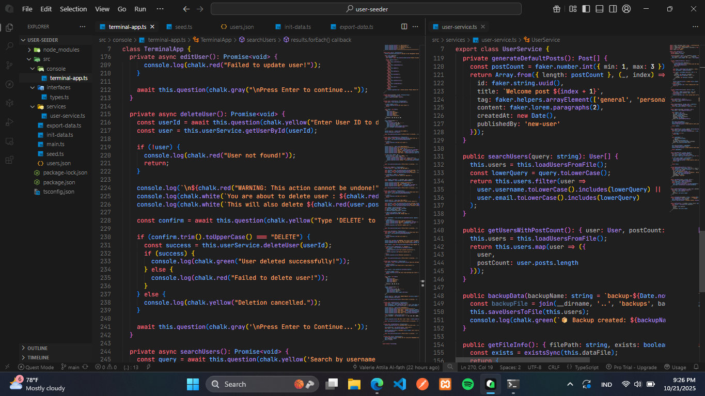
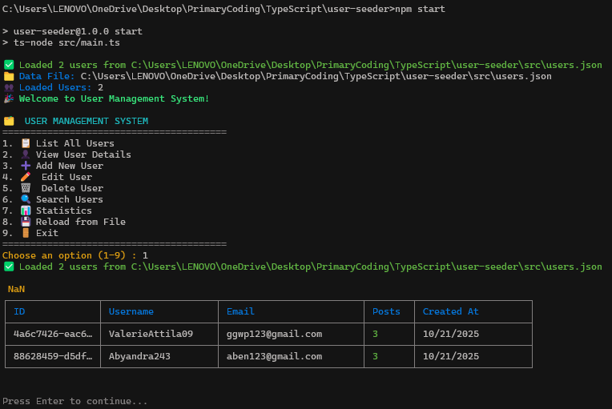

# User Management System

Sebuah aplikasi manajemen user yang dibangun dengan TypeScript dan Faker.js untuk menghasilkan data dummy. Aplikasi ini menyediakan antarmuka terminal yang interaktif untuk melakukan operasi CRUD (Create, Read, Update, Delete) pada data user dan post.



[](https://skillicons.dev)


### 🚀 Fitur

· User Management: Tambah, edit, hapus, dan lihat user
· Post Management: Setiap user dapat memiliki multiple posts
· Data Persistence: Semua data disimpan dalam file users.json
· Search Functionality: Cari user berdasarkan username atau email
· Statistics: Tampilkan statistik data users dan posts
· Interactive Terminal UI: Antarmuka yang user-friendly dengan warna dan emoji
· Dummy Data Generation: Generate data realistis menggunakan Faker.js

### 📋 Requirements

· Node.js (v14 atau lebih tinggi)
· npm atau yarn

### 🛠️ Instalasi

1. Clone atau download project ini
2. Install dependencies

```bash
npm install
```

1. Initialize data (opsional - untuk data dummy awal)

```bash
npm run init
```

🎮 Cara Menggunakan

Menjalankan Aplikasi

```bash
npm start
```

Generate Data Dummy

```bash
npm run seed
```

Reset Data ke Awal

```bash
npm run reset
```

### 📁 Struktur Project

```
user-management-system/
├── src/
│   ├── types.ts          # Type definitions (User, Post)
│   ├── seed.ts           # Data dummy generator
│   ├── user-service.ts   # CRUD operations & file management
│   ├── terminal-app.ts   # Terminal interface
│   ├── main.ts           # Application entry point
│   └── init-data.ts      # Data initialization
├── users.json            # Main data file (auto-generated)
├── seed-data.json        # Backup seed data
├── package.json
└── README.md
```

### 🎯 Menu Aplikasi

1. 📋 List All Users

Menampilkan semua user dalam format tabel dengan informasi:

· ID
· Username
· Email
· Jumlah Posts
· Tanggal dibuat

2. 👤 View User Details

Menampilkan detail lengkap user berdasarkan ID:

· Informasi user
· List semua posts milik user

3. ➕ Add New User

Menambahkan user baru dengan input:

· Username
· Email
· Password

4. ✏️ Edit User

Mengedit data user berdasarkan ID:

· Update username, email, atau password
· Field kosong akan mempertahankan nilai lama

5. 🗑️ Delete User

Menghapus user berdasarkan ID dengan konfirmasi:

· Ketik "DELETE" untuk konfirmasi
· Otomatis menghapus semua posts user tersebut

6. 🔍 Search Users

Mencari user berdasarkan:

· Username
· Email

7. 📊 Statistics

Menampilkan statistik:

· Total users
· Total posts
· Users dengan posts
· Rata-rata posts per user
· User baru (7 hari terakhir)

8. 💾 Reload from File

Memuat ulang data dari file users.json

9. 🚪 Exit

Keluar dari aplikasi

### 📊 Data Structure

User

```typescript
interface User {
  id: string;
  username: string;
  email: string;
  password: string;
  createdAt: Date;
  posts: Post[];
}
```

Post

```typescript
interface Post {
  id: string;
  title: string;
  tag: string;
  content: string;
  createdAt: Date;
  publishedBy: string; // user ID
}
```

### 🗃️ File Data

users.json

File utama yang menyimpan semua data users dan posts. File ini akan:

· Dibuat otomatis saat pertama kali menjalankan aplikasi
· Diupdate otomatis saat ada perubahan data
· Dibaca setiap kali aplikasi dimulai

seed-data.json

Backup data dummy yang dihasilkan oleh seeder.

### 🔧 Development

Build Project

```bash
npm run build
```

Development Mode

```bash
npm run dev
```

Dependencies Utama

· @faker-js/faker - Generate data dummy realistis
· typescript - Type safety
· chalk - Terminal styling dengan warna
· cli-table3 - Tabel rapi di terminal
· readline - Input interaktif

### 🐛 Troubleshooting

Error: `File tidak ditemukan`

· Jalankan npm run init untuk membuat file data awal

Error: `Data corrupt`

· Jalankan npm run reset untuk mengembalikan data ke keadaan awal

Error: `Module tidak ditemukan`

· Hapus folder node_modules dan jalankan npm install kembali

### 📝 Contoh Penggunaan

Menambah User Baru

1. Pilih menu "3. Add New User"
2. Input username, email, dan password
3. Data otomatis tersimpan ke users.json

Mencari User

1. Pilih menu "6. Search Users"
2. Masukkan keyword username atau email
3. Sistem akan menampilkan hasil pencarian

Melihat Statistik

1. Pilih menu "7. Statistics"
2. Sistem menampilkan overview data yang ada

### 🤝 Kontribusi

1. Fork project ini
2. Buat feature branch (git checkout -b feature/AmazingFeature)
3. Commit perubahan (git commit -m 'Add some AmazingFeature')
4. Push ke branch (git push origin feature/AmazingFeature)
5. Buat Pull Request

### 📄 License

Distributed under the MIT License. See LICENSE for more information.

### 🆘 Bantuan

Jika mengalami masalah:

1. Pastikan semua dependencies terinstall
2. Cek bahwa Node.js versi 14+
3. Pastikan file users.json ada di root directory
4. Buka issue di repository jika masalah berlanjut

---

**_Happy Coding! 🚀_**
